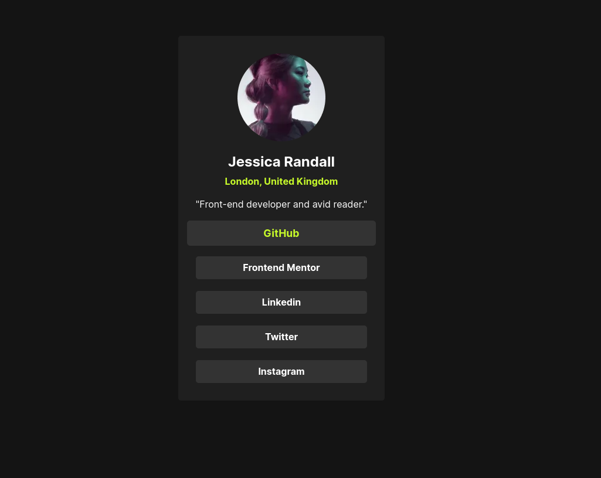

# :iphone: Social Links Profile

Este projeto é uma implementação do desafio Social Links Profile do Frontend Mentor.

Ele foi desenvolvido como parte dos meus estudos iniciais em React, visando aplicar os conhecimentos que estou adquirindo nesta tecnologia. :mortar_board:

## :pushpin: Visão Geral

Este é um projeto simples e sem interação, focado apenas na criação de componentes visuais. Ele não possui funcionalidades complexas ou lógica de programação avançada, foi uma oportunidade para praticar a criação e estilização de componentes utilizando `React` e `Styled Components`.

Além disso, o projeto foi desenvolvido com o cuidado de garantir uma boa performance, utilizando o `Lighthouse` para avaliar e otimizar o desempenho.

## :wrench: Tecnologias Utilizadas

:ballot_box_with_check: React

:ballot_box_with_check: Styled Components

## :computer: Abrir e rodar o projeto

Para abrir e rodar este projeto em sua máquina local, siga estas etapas:

- Clonar o Repositório
- Acessar o Diretório do Projeto
- Instalar as Dependências com `npm install`
- Executar o Projeto com `npm run dev`

O projeto será aberto automaticamente no seu navegador padrão.